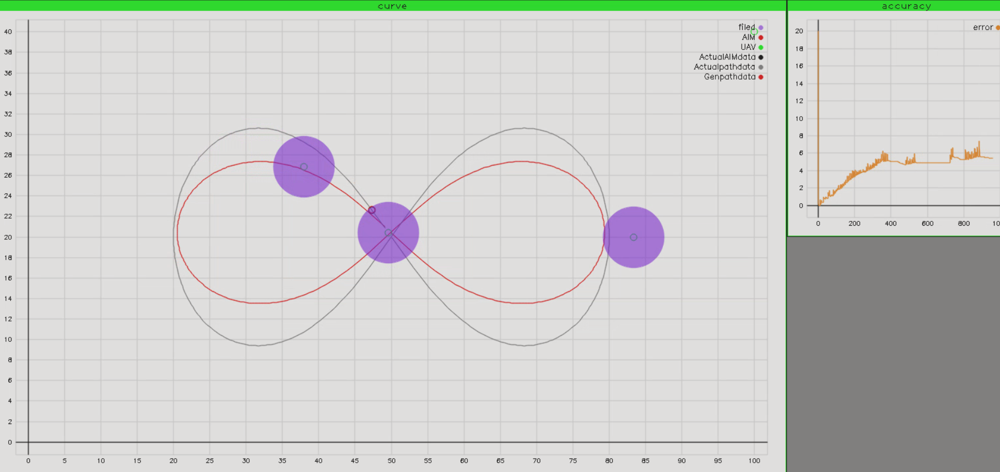

# SmithServices
加油啊，航空史密斯



## environment test
- Ubuntu 16.04
- GNU 5.4.0
- Opencv 3.3.1
- yaml-cpp 0.6
- ceres

## build
~~需要google求解器~~
```shell

```
```shell
mkdir build &  cd build
cmake ..
make
```

### 虚拟串口
因为测试用的CH340G为半双工，不能同发同受，可以用虚拟串口测试
```shell
sudo apt-get install socat
socat -d -d pty,raw,echo=0 pty,raw,echo=0

```

## run
### 配置文件 param.yaml
- map_width : 地图宽
- map_length : 地图长
- BALLON_num : 气球个数 
- AIMUAV_num : 目标机个数
- Listen_port : 服务串口
- Simulate_port : 仿真串口
- UAV_filed : UAV视野
- UAV_speed : UAV速度
- start_point : UAV起始坐标
- first_point ：UAV第一次设定坐标
- end_point ： UAV返回坐标
- Simulate_speed : 仿真目标机速度
- ballon_point : 气球坐标

```shell
./bin/RunService param.yaml
```
